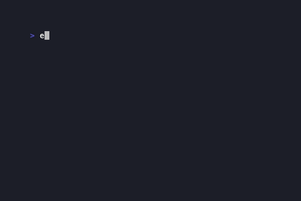

# Conway's Game of Life

A Java implementation of Conway's Game of Life with a command-line interface.



## Overview

The Game of Life is a cellular automaton devised by mathematician John Conway. The simulation takes place on a grid of cells where each cell can be either "alive" or "dead". The state of each cell in the next generation is determined by these rules:

1. **Underpopulation**: A living cell with fewer than 2 living neighbors dies
2. **Survival**: A living cell with 2 or 3 living neighbors stays alive
3. **Overpopulation**: A living cell with more than 3 living neighbors dies
4. **Reproduction**: A dead cell with exactly 3 living neighbors comes to life

This implementation uses a toroidal grid (edges wrap around to the opposite side).

## Requirements

- Java 17 or higher
- Gradle 8.x (or use the included Gradle wrapper)

## Building

```bash
./gradlew build
```

## Running

### Quick Start - Visual Verification

Use preset patterns to verify the rules work correctly:

```bash
# Blinker - oscillates between vertical and horizontal (period 2)
./gradlew run --args="--pattern blinker"

# Block - static 2x2 square that never changes
./gradlew run --args="--pattern block"

# Glider - moves diagonally across the grid
./gradlew run --args="--pattern glider"
```

### Random Initialization

```bash
./gradlew run                              # Default 40x20, 30% density
./gradlew run --args="-p 0.4 -w 15 -h 10"  # Custom size and density
```

### Custom Cell Coordinates

Set specific cells using `row,col` pairs separated by semicolons:

```bash
# Manual blinker at position (1,1), (1,2), (1,3)
./gradlew run --args="--cells '1,1;1,2;1,3' -w 5 -h 5"

# L-shape
./gradlew run --args="--cells '0,0;1,0;2,0;2,1' -w 6 -h 6"
```

### Command-Line Options

| Option | Description | Default |
|--------|-------------|---------|
| `-w, --width <n>` | Grid width | 40 (or pattern's recommended) |
| `-h, --height <n>` | Grid height | 20 (or pattern's recommended) |
| `-d, --delay <ms>` | Delay between generations | 200 |
| `-p, --probability <n>` | Random alive probability (0.0-1.0) | 0.3 |
| `-P, --pattern <name>` | Preset pattern: `blinker`, `block`, `glider` | - |
| `-c, --cells <coords>` | Explicit cells: `"row,col;row,col;..."` | - |
| `--help` | Show help message | - |

## Running Tests

```bash
./gradlew test
```

## Preset Patterns

| Pattern | Behavior | Use Case |
|---------|----------|----------|
| `blinker` | Period-2 oscillator (vertical ↔ horizontal) | Verify oscillation rules |
| `block` | Still life (never changes) | Verify stable configurations |
| `glider` | Moves diagonally, period 4 | Verify all rules working together |

## Project Structure

```
src/
├── main/java/com/gameoflife/
│   ├── Cell.java           # Cell state enum (ALIVE/DEAD)
│   ├── Grid.java           # Grid with toroidal wrapping
│   ├── GameRules.java      # Conway's 4 rules
│   ├── GameOfLife.java     # Simulation orchestrator
│   ├── Pattern.java        # Preset patterns (blinker, block, glider)
│   ├── ConsoleRenderer.java # Colored grid display
│   └── Main.java           # CLI entry point
└── test/java/com/gameoflife/
    ├── GridTest.java       # Grid and wrapping tests
    ├── GameRulesTest.java  # All rule combinations (parameterized)
    ├── GameOfLifeTest.java # Integration tests
    └── PatternTest.java    # Pattern behavior tests
```

## Design Decisions

- **Separation of Concerns**: Grid (state), Rules (logic), Renderer (display), Pattern (initialization)
- **Toroidal Grid**: Edges wrap to opposite sides
- **Preset Patterns**: Canonical patterns for visual verification of correctness
- **Coordinate Initialization**: Explicit cell placement for custom testing

## Complexity Analysis

| Operation | Time | Space |
|-----------|------|-------|
| `nextGeneration()` | O(w × h) | O(w × h) |
| `countAliveNeighbors()` | O(1) | O(1) |
| `getNextState()` | O(1) | O(1) |
| `render()` | O(w × h) | O(w × h) |

- **Per generation**: O(w × h) time, O(w × h) auxiliary space for the temporary grid
- **Total memory**: 2 × w × h cells (current grid + temporary grid during update)
- The temporary grid is necessary because all cells must update simultaneously

## Limitations & Edge Cases

### Known Limitations

| Limitation | Reason | Potential Improvement |
|------------|--------|----------------------|
| **Large grids (10,000×10,000)** | O(n²) memory and time per generation | Use sparse representation (HashSet of live cells) for grids with low density |
| **Not thread-safe** | Mutable shared state in Grid | Immutable Grid + functional updates, or synchronization |
| **Memory per generation** | Allocates new grid each generation | Double-buffering (swap two pre-allocated grids) |
| **ANSI terminal required** | Colors/clearing use ANSI escape codes | Fallback to plain ASCII mode for unsupported terminals |

### Edge Cases

| Case | Behavior |
|------|----------|
| **1×1 grid** | Single cell always dies (0 neighbors, underpopulation) |
| **Empty grid** | Stays empty forever |
| **Full grid** | All cells die from overpopulation (8 neighbors each), then stays empty |
| **Negative coordinates** | Handled via `Math.floorMod()` - wraps correctly |
| **Probability 0.0** | Empty grid |
| **Probability 1.0** | Full grid → all die → empty |

### What This Implementation Does NOT Handle

- **Infinite grids**: Fixed dimensions with toroidal wrapping instead
- **Stabilization detection**: No detection of still lifes or oscillators reaching steady state
- **Pattern file loading**: No RLE/Life 1.06 file format support (could be added)
- **History/undo**: No generation history stored
- **GUI**: Console-only (but Renderer is decoupled for easy extension)
